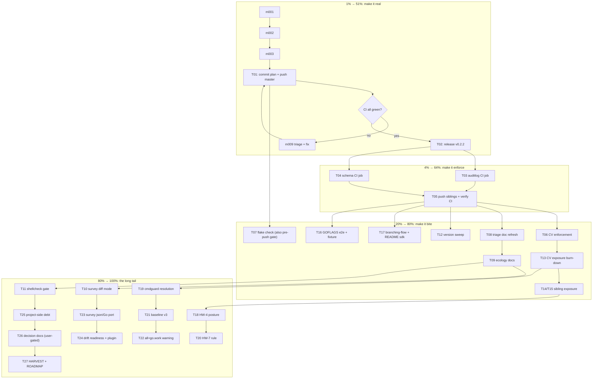

# SUPERB PARETO EXECUTION PLAN V2 — Release & Ratchet Rollout

**Created:** 2026-09-16 18:55 CEST · **Repo:** samber-linter (scope: 4 repos + cmdguard decision) · **Method:** pareto-planning skill; Markdown + mermaid per explicit user instruction (skill's HTML/D2 default overridden)

## Context (why this plan looks like this)

This session's round landed: the CLI/SDK loader split-brain fix (shared `load`, GOFLAGS sanitization), the snippet gate over `docs/status/**`, CV's schema-v2 baseline (10/30 = 33%), sibling baselines (auditlog 12/20 = 60%, standard-bug 2/61 = 3%), the ecology-survey go.work over-scan fix (per-module `./...`), and the corrected survey (66 analyzed · 50 clean · 16 with findings · 56 findings · 4 load errors; CV honestly rank 3, 0 findings).

Everything above is **local-only**. samber-linter is 10 commits ahead of origin; auditlog 2; standard-bug 1; CV 2 **plus a dirty file nobody in this session authored** (`assets/js/pipeline-board.js`) — CV stays unpushed. The single blocking fact: **nothing can be verified or enforced until the commits are pushed and a release exists.** v0.2.1 (the only released linter) fails closed on baseline schema v2, so wiring CI jobs before the release would guarantee red CI.

Sources consolidated (ALL outstanding todos, no orphans): `TODO_LIST.md` (quality gate, release-gated wiring, cmdguard decision, triage refresh, open decisions), the 2026-09-16 18:44 status report §a–g (50 next-step items), §e improvements, and this session's pending gate (`nix flake check`) — every item is mapped to exactly one big task T01–T27 and exploded into ≤12-min micro tasks m001–m096.

## Pareto breakdown

| Tier              | Tasks                                                                          | Cumulative value | Why                                                                                                                                                                                      |
| ----------------- | ------------------------------------------------------------------------------ | ---------------- | ---------------------------------------------------------------------------------------------------------------------------------------------------------------------------------------- |
| **1%**            | T01 (push master + watch CI)                                                   | **51%**          | ~7 unreleased commits become observable; the v2.13.2 lint pin gets its first real GitHub run; "first all-green CI" stops being a claim and becomes a fact; every downstream task unlocks |
| **4%**            | T01–T05 (push, CI proof, release v0.2.2, wire both sibling CIs, push siblings) | **64%**          | A release that supports schema v2 exists; both sibling repos enforce their committed baselines in CI; the ratchet is live where the ecology's biggest offenders were already fixed       |
| **20%**           | T01–T08 (+ CV enforcement, flake check, triage truth)                          | **80%**          | All four consumer repos either enforce or are honestly documented; local gates green; the survey's canonical numbers are written down where decisions are made                           |
| **Remaining 80%** | T09–T27                                                                        | **100%**         | Exposure burn-down (CV 20, auditlog 8, schema 61-registered), rule work (HW-4, HW-7), schema v3, survey ergonomics, project-side debt, user decisions                                    |

## Comprehensive plan — big tasks (30–100 min each, ALL todos included, sorted by impact)

| ID  | Task                                                                                                                                                   | Min | Impact | Effort | Value | Covers (status-report §f / TODO_LIST) | Tier |
| --- | ------------------------------------------------------------------------------------------------------------------------------------------------------ | --- | ------ | ------ | ----- | ------------------------------------- | ---- |
| T01 | Push `master`, watch the first all-green CI run, update docs that say "unobserved"                                                                     | 45  | 10     | 2      | 10    | f1, f8, TODO quality gate             | 1%   |
| T02 | Tag & release v0.2.2: CHANGELOG cut, pre-release verification, annotated tag, module-proxy check                                                       | 60  | 10     | 4      | 9     | f3, f47                               | 4%   |
| T03 | Wire health-wash CI job into samber-do-auditlog (pin v0.2.2, recipe in their AGENTS)                                                                   | 30  | 9      | 3      | 8     | f4                                    | 4%   |
| T04 | Wire health-wash CI job into standard-bug-tracking-schema (pin v0.2.2)                                                                                 | 30  | 9      | 3      | 8     | f5                                    | 4%   |
| T05 | Push auditlog + schema repos, verify their CI runs green                                                                                               | 30  | 8      | 2      | 8     | f20                                   | 4%   |
| T06 | Wire baseline enforcement into CV (flake check step or CI job) so 10/30 actually bites                                                                 | 90  | 9      | 5      | 9     | f7, §b.4, Q3                          | 20%  |
| T07 | Full `nix flake check` on this round's tree; burn any fallout                                                                                          | 30  | 8      | 3      | 7     | f2, §b.3                              | 20%  |
| T08 | Finish pseudonymous triage doc refresh from `docs/ecology/2026-09-16-scan-per-module-fixed.txt`                                                        | 45  | 7      | 3      | 7     | f6, §b.1                              | 20%  |
| T09 | Ecology docs package: `docs/ecology/README` (canonical table), supersede 2026-09-10 doc, README survey-usage section, FP-BUDGETS HW-unresolved row     | 45  | 6      | 3      | 6     | f14, f15, f36, f22                    | 80%  |
| T10 | Survey diff mode: delta vs previous run, metadata+duration logging, load-error flip attribution                                                        | 90  | 7      | 5      | 6     | f11, f12, §e.4                        | 80%  |
| T11 | shellcheck hermetic check in flake; burn findings in `scripts/*.sh`                                                                                    | 60  | 6      | 4      | 5     | f10, §e.3                             | 80%  |
| T12 | golangci version-policy sweep: auditlog CI cache-key+pin v2.12.2→v2.13.2, audit schema + branching-flow                                                | 45  | 6      | 3      | 5     | f21                                   | 80%  |
| T13 | CV exposure triage: 20 unprotected services → honest checks or reason-carrying suppressions                                                            | 90  | 8      | 6      | 8     | f48                                   | 80%  |
| T14 | auditlog exposure triage: 8 unprotected services                                                                                                       | 60  | 6      | 4      | 6     | f49                                   | 80%  |
| T15 | standard-bug exposure review: 61 registered / 2 checked — what should actually be checked                                                              | 60  | 5      | 4      | 5     | f15-adjacent                          | 80%  |
| T16 | CLI GOFLAGS e2e test via `Run()` + dependency self-registration fixture in `testdata/`                                                                 | 60  | 5      | 4      | 5     | f16, f17                              | 80%  |
| T17 | branching-flow `doanalyzerv2` compile check against new driver; README section for `pkg/sdk`                                                           | 45  | 5      | 3      | 5     | f18, f19                              | 80%  |
| T18 | HW-4 posture: implement the user's decision (default-on info vs opt-in) + FP-BUDGETS update                                                            | 90  | 7      | 5      | 7     | f24, f41                              | 80%  |
| T19 | cmdguard HW-2: implement the chosen resolution (adapter / breaking rename / suppression) + re-survey cmdguard row                                      | 90  | 7      | 6      | 7     | f9, Q2                                | 80%  |
| T20 | HW-7 stale-directive rule prototype + tests (valid-but-orphaned directives with `until`)                                                               | 100 | 6      | 7      | 5     | f25                                   | 100% |
| T21 | Baseline schema v3: store scan patterns at set-baseline, fail loudly on scope mismatch                                                                 | 100 | 6      | 7      | 5     | f26, §e.6                             | 100% |
| T22 | Driver warning when pattern `all` meets a go.work target                                                                                               | 45  | 4      | 2      | 4     | f27, §e.7                             | 100% |
| T23 | Survey `--output json` + spike: port survey scoring from bash to a Go command                                                                          | 100 | 5      | 7      | 4     | f28, f29                              | 100% |
| T24 | samber/do v2.2.x drift readiness (re-run drift matrix policy) + plugin v2.13.2 CI verification                                                         | 45  | 4      | 3      | 4     | f31, f32                              | 100% |
| T25 | Project-side debt sprint: reports/app `sessions` redeclaration, Kernovia 1.27 floor, archived repos tidy-or-delete, Standup-Killer flip explanation    | 90  | 4      | 5      | 3     | f37, f38, f39, f40, f13               | 100% |
| T26 | Decision documents (user-gated): upstream #317/#318 ownership+SLA, `.crush` purge, survey scope (`archived/` default?), ecology finish-line definition | 45  | 5      | 2      | 5     | f43, f44, f42, f45, f46, f50          | 100% |
| T27 | HARVEST this plan into TODO_LIST/ROADMAP: keyfile bootstrap doc, healthaudit scope, DO-9 completion, self-reg rule decision, `docs/ecology` retention  | 60  | 5      | 3      | 4     | f30, f33, f34, f35, f27b              | 100% |

## Detailed breakdown — micro tasks (≤12 min each, ALL todos included, sorted by execution order)

| ID   | Micro task                                                                                    | ≤min | From | Tier |
| ---- | --------------------------------------------------------------------------------------------- | ---- | ---- | ---- |
| m001 | Verify clean tree (`git status`), no stray daemon half-commits                                | 5    | T07  | 1%   |
| m002 | Run `nix flake check`; capture raw exit (no pipes)                                            | 10   | T07  | 1%   |
| m003 | Burn any flake fallout, re-run to green                                                       | 12   | T07  | 1%   |
| m004 | Commit plan + any pending docs with detailed messages (done by this very commit)              | 8    | T01  | 1%   |
| m005 | `git push origin master` (samber-linter)                                                      | 2    | T01  | 1%   |
| m006 | `gh run list` → identify the triggered run                                                    | 3    | T01  | 1%   |
| m007 | Watch `lint` job specifically (v2.13.2 pin's first run)                                       | 10   | T01  | 1%   |
| m008 | Watch remaining jobs (test, dogfood, drift-matrix, upstream-snippets)                         | 10   | T01  | 1%   |
| m009 | If red: triage via `gh run view --log-failed`, fix, re-push                                   | 12   | T01  | 1%   |
| m010 | All green → delete TODO "quality gate" item; fix AGENTS/CHANGELOG "unobserved" wording        | 10   | T01  | 1%   |
| m011 | Cut CHANGELOG Unreleased → [0.2.2] with date                                                  | 8    | T02  | 4%   |
| m012 | Pre-release verification: build, full tests, lint, dogfood binary against fixture module      | 12   | T02  | 4%   |
| m013 | Annotated tag v0.2.2 on the verified commit                                                   | 5    | T02  | 4%   |
| m014 | Push tag; verify module proxy serves v0.2.2 (`go list -m -versions`)                          | 8    | T02  | 4%   |
| m015 | `go run ...@v0.2.2 ./...` smoke in a scratch module — schema v2 baseline accepted             | 10   | T02  | 4%   |
| m016 | Write auditlog CI job YAML from their AGENTS recipe (pinned SHAs, env, timeout)               | 12   | T03  | 4%   |
| m017 | Pin `@v0.2.2`; actionlint-verify the workflow locally                                         | 10   | T03  | 4%   |
| m018 | Update their AGENTS CI section (8→9 jobs)                                                     | 8    | T03  | 4%   |
| m019 | Commit with detailed message (their daemon may race — re-check `status --short` first)        | 8    | T03  | 4%   |
| m020 | Write schema CI job YAML (same recipe, their conventions)                                     | 12   | T04  | 4%   |
| m021 | actionlint + AGENTS CI-section update (schema)                                                | 10   | T04  | 4%   |
| m022 | Commit (schema)                                                                               | 5    | T04  | 4%   |
| m023 | Push auditlog master; watch its CI (doc+baseline+wiring only → must stay green)               | 10   | T05  | 4%   |
| m024 | Push schema main; watch its CI                                                                | 10   | T05  | 4%   |
| m025 | Confirm both repos' health-wash jobs ran green on their own runners                           | 10   | T05  | 4%   |
| m026 | CV: read flake.nix checks structure; pick enforcement point (checkPhase vs CI)                | 12   | T06  | 20%  |
| m027 | CV: add samber-linter gate (build linter from pinned source or module)                        | 12   | T06  | 20%  |
| m028 | CV: wire baseline path + the 9-module pattern; prove gate passes                              | 12   | T06  | 20%  |
| m029 | CV: negative path — temporarily inflate coverage claim, watch gate fail                       | 12   | T06  | 20%  |
| m030 | CV: document the gate in CV's AGENTS; commit                                                  | 10   | T06  | 20%  |
| m031 | CV: run CV's full gates (`nix flake check` there)                                             | 12   | T06  | 20%  |
| m032 | Triage-doc: re-read 2026-09-10 doc; extract still-valid structure                             | 10   | T08  | 20%  |
| m033 | Triage-doc: embed corrected table (ranks 1–65 + load errors)                                  | 12   | T08  | 20%  |
| m034 | Triage-doc: per-rule findings distribution + regression-trio proof section                    | 12   | T08  | 20%  |
| m035 | Triage-doc: cmdguard ownership note (HW-2 lives there, not CV)                                | 10   | T08  | 20%  |
| m036 | Triage-doc: supersede marker on the 2026-09-10 doc pointing here                              | 8    | T08  | 20%  |
| m037 | Ecology README: what the two 2026-09-16 files are, which is canonical                         | 10   | T09  | 80%  |
| m038 | README: survey usage + interpretation of ranked columns                                       | 12   | T09  | 80%  |
| m039 | FP-BUDGETS: HW-unresolved budget row (0 under per-module; `all` caveat)                       | 10   | T09  | 80%  |
| m040 | Survey: design diff output (new/gone rows, coverage deltas, flips)                            | 12   | T10  | 80%  |
| m041 | Survey: persist metadata (timestamp, scanner version, durations)                              | 12   | T10  | 80%  |
| m042 | Survey: record go.mod/go.sum hashes for flip attribution                                      | 12   | T10  | 80%  |
| m043 | Survey: implement diff rendering + self-test on the two 2026-09-16 tables                     | 12   | T10  | 80%  |
| m044 | Survey: docs for the diff mode                                                                | 8    | T10  | 80%  |
| m045 | Flake: add shellcheck (or pinned bash linter) to checks                                       | 12   | T11  | 80%  |
| m046 | Run it on `scripts/*.sh`; collect findings                                                    | 8    | T11  | 80%  |
| m047 | Burn findings in ecology-scan + snippet scripts; re-run gate                                  | 12   | T11  | 80%  |
| m048 | auditlog: bump cache key + install pin to v2.13.2                                             | 10   | T12  | 80%  |
| m049 | Audit schema + branching-flow golangci pins; align                                            | 12   | T12  | 80%  |
| m050 | Verify version guard script (auditlog check-go-version) still passes                          | 8    | T12  | 80%  |
| m051 | CV: pull the 20-unprotected list from the survey + per-service notes                          | 12   | T13  | 80%  |
| m052 | CV: implement honest `HealthCheck(ctx)` for the top cluster                                   | 12   | T13  | 80%  |
| m053 | CV: continue implementations (batch 2)                                                        | 12   | T13  | 80%  |
| m054 | CV: continue implementations (batch 3)                                                        | 12   | T13  | 80%  |
| m055 | CV: suppressions with reasons only where a check is genuinely wrong                           | 12   | T13  | 80%  |
| m056 | CV: re-run linter; confirm coverage >33%; re-baseline only if justified                       | 12   | T13  | 80%  |
| m057 | auditlog: pull the 8-unprotected list; classify                                               | 10   | T14  | 80%  |
| m058 | auditlog: implement checks / suppress with reasons                                            | 12   | T14  | 80%  |
| m059 | auditlog: re-run + re-baseline if improved; gates                                             | 12   | T14  | 80%  |
| m060 | schema: inventory the 61 registrations; identify the 2 checked                                | 12   | T15  | 80%  |
| m061 | schema: decide + implement checks for the honest core                                         | 12   | T15  | 80%  |
| m062 | schema: re-run + re-baseline                                                                  | 10   | T15  | 80%  |
| m063 | Write `TestRunSurvivesHostileGoFlags` end-to-end through `Run()`                              | 12   | T16  | 80%  |
| m064 | Add `testdata` fixture: dependency package that self-registers                                | 12   | T16  | 80%  |
| m065 | Assert per-module doctrine in an analysistest (dep's registrations not attributed)            | 12   | T16  | 80%  |
| m066 | branching-flow: build `pkg/doanalyzerv2` against new driver                                   | 12   | T17  | 80%  |
| m067 | branching-flow: fix any API fallout; their gates                                              | 12   | T17  | 80%  |
| m068 | README: `pkg/sdk` section (Analyze contract, error semantics)                                 | 12   | T17  | 80%  |
| m069 | HW-4: write up both postures with FP-budget impact numbers                                    | 12   | T18  | 80%  |
| m070 | HW-4: implement chosen default + flag override                                                | 12   | T18  | 80%  |
| m071 | HW-4: tests + FP-BUDGETS update + survey re-run spot-check                                    | 12   | T18  | 80%  |
| m072 | cmdguard: implement decision (a/b/c) — part 1                                                 | 12   | T19  | 80%  |
| m073 | cmdguard: implementation — part 2 + their tests                                               | 12   | T19  | 80%  |
| m074 | cmdguard: their gates; re-survey; confirm cmdguard row clean                                  | 12   | T19  | 80%  |
| m075 | HW-7: rule design (directive with `until`, orphaned, expired)                                 | 12   | T20  | 100% |
| m076 | HW-7: implement in healthwash + message/FP-budget                                             | 12   | T20  | 100% |
| m077 | HW-7: golden fixtures + mutant discrimination proof                                           | 12   | T20  | 100% |
| m078 | HW-7: README rule-table + docs updates                                                        | 10   | T20  | 100% |
| m079 | Baseline v3: schema design (patterns array, version bump, migration)                          | 12   | T21  | 100% |
| m080 | Baseline v3: implement write-side (set-baseline stores patterns)                              | 12   | T21  | 100% |
| m081 | Baseline v3: implement check-side (scope mismatch fails loudly)                               | 12   | T21  | 100% |
| m082 | Baseline v3: tests incl. migration v2→v3 + loud-failure negative paths                        | 12   | T21  | 100% |
| m083 | Driver: detect go.work + `all` pattern → warning to stderr                                    | 10   | T22  | 100% |
| m084 | Driver: test the warning; docs contract row                                                   | 8    | T22  | 100% |
| m085 | Survey: `--output json` flag emitting machine-readable rows                                   | 12   | T23  | 100% |
| m086 | Survey: Go-port spike — scoring+ranking in a cmd/ survey command                              | 12   | T23  | 100% |
| m087 | Survey: decide keep/bash vs port; record decision                                             | 8    | T23  | 100% |
| m088 | Drift readiness: document the re-run checklist for samber/do v2.2.x                           | 10   | T24  | 100% |
| m089 | Plugin: confirm v2.13.2 custom-build CI job green after loader change                         | 10   | T24  | 100% |
| m090 | reports/app: fix `sessions` redeclaration (their repo, small)                                 | 12   | T25  | 100% |
| m091 | Kernovia: assess 1.27 floor; fix or document exclusion                                        | 12   | T25  | 100% |
| m092 | archived repos: tidy-or-delete decision + execution                                           | 12   | T25  | 100% |
| m093 | Standup-Killer: explain the flip via their git log; note in survey docs                       | 8    | T25  | 100% |
| m094 | Decision docs: upstream SLA, `.crush`, survey scope, ecology finish line                      | 12   | T26  | 100% |
| m095 | Post decisions to TODO_LIST "Open decisions" + ping user                                      | 10   | T26  | 100% |
| m096 | HARVEST: TODO_LIST/ROADMAP updates (keyfile doc, healthaudit, DO-9, self-reg rule, retention) | 12   | T27  | 100% |

Total: 27 big tasks (≈33 h) · 96 micro tasks (≈15 h focused) · nothing from the sources left unmapped.

## Execution graph



## Verschlimmbesser-guards (how this plan avoids making things worse)

1. **Gates before and after every push** — `nix flake check` locally (T07 runs before T01's push completes its verification loop); no green, no push.
2. **CV is never pushed by this plan** — its tree carries a foreign uncommitted change (`assets/js/pipeline-board.js`) and 2 ahead-commits not authored in this session; publishing it is the owner's call.
3. **Releases only from verified commits** — the tag lands on the exact commit whose CI run is green, never on HEAD-minus-verification.
4. **Schema evolution stays loud** — v3 (T21) must keep the v2 loud-failure behavior (unknown schema → hard fail with migration hint), never silent tolerance.
5. **Suppressions carry reasons or don't exist** — every exposure burn-down task (T13–T15, T19) prefers honest checks; suppressions only with documented, reviewable reasons.
6. **The daemon commits continuously** — before every explicit commit: re-check `git status --short`; commit per task, never batch unrelated work.
7. **Negative paths are proven, not assumed** — enforcement wiring (T06), gates (T11), and rules (T20) each get a "watch it fail" step before "watch it pass".

## Verification commands (the plan's definition of "works")

```bash
nix flake check                                                  # local umbrella
GOEXPERIMENT=jsonv2 CGO_ENABLED=0 go test ./... -count=1         # repo suite
gh run watch                                                     # pushed CI
go run github.com/larsartmann/samber-linter/cmd/samber-linter@v0.2.2 ./...   # released binary, schema v2 accepted
scripts/ecology-scan.sh > /tmp/ecology-$(date +%F)-v3.txt 2>&1   # post-rollout survey, persistent file
```
