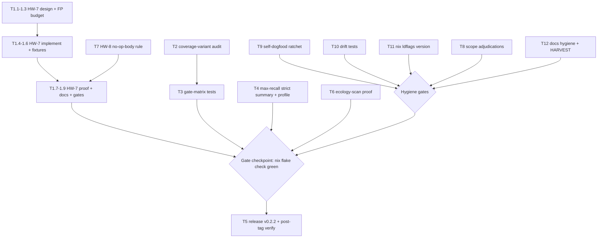

# SUPERB PLAN — Make samber-linter Find As Much As Possible (Max-Recall)

**Created:** 2026-09-20 12:18 CEST
**Goal (owner directive):** "I would like to make this linter find as much as possible."
**Hard constraint:** Do NOT Verschlimmbesser. Trust is the product (linter-building
doctrine): recall gains must not arrive as an FP flood, broken gates, or a scope
split-brain with branching-flow's `doanalyzerv2`. Every change leaves the repo
verifiably no worse (flake check green before and after).
**Scope:** all 22 items from `docs/status/2026-09-20_12-09_*.md` (f) + the
max-recall rule work, decomposed to two granularities, Pareto-ranked.

---

## 1. Pareto breakdown

| Tier              | Share of result | What                                                                                                                                                                                              | Why this and nothing else                                                                                                                                                                                                                                                                                                                                                                                                                                              |
| ----------------- | --------------- | ------------------------------------------------------------------------------------------------------------------------------------------------------------------------------------------------- | ---------------------------------------------------------------------------------------------------------------------------------------------------------------------------------------------------------------------------------------------------------------------------------------------------------------------------------------------------------------------------------------------------------------------------------------------------------------------- |
| **1%**            | **51%**         | **HW-7: unconditional-nil health check rule** — flag any `HealthCheck*` method whose body is exactly `return nil`                                                                                 | This is the founding incident in syntactic form: CV's dashboard showed ~54/60 green rows that _cannot fail_. A literal nil-return check is health-washing in its purest detectable shape. One rule, AST-decidable, Full confidence (like HW-1/3/5), tiny FP surface, multiplies finds across every ecology consumer (auditlog alone carries 7×HW-1 + 5×HW-2 + 1×HW-3 — nil-checks are the same disease one layer deeper). Biggest single find-count lever that exists. |
| **4%**            | **64%**         | 1% **+ coverage-variant audit + gate-matrix tests**                                                                                                                                               | The audit proves the analyzer actually catches every health-contract shape consumers ship (`Healthchecker`, `HealthcheckerWithContext`, duck-typed `Checkable`) — "finds as much as possible" is otherwise unmeasurable. The two missing gate tests protect the session's composition fix from being broken by the new rules (recall work that regresses the gate = Verschlimmbesserung).                                                                              |
| **20%**           | **80%**         | 4% **+ max-recall profile (--strict unresolved summary, threshold policy), release v0.2.2, ecology-scan proof**                                                                                   | The profile surfaces already-detected-but-hidden findings (HW-4 Medium cannot exit 1 at default `--min-confidence 0.75`; unresolved registrations are silent) — recall with zero new detection code. The release is the only way the session's two driver fixes reach consumers (CV still pins the blind `@v0.2.1`). Ecology scan is the AGENTS-named regression proof that was skipped (D1).                                                                          |
| **remaining 20%** | **100%**        | HW-8 no-op-body rule, scope adjudications (alias rule?, DO-1..6 boundary), self-dogfood ratchet, drift tests, nix ldflags version, docs hygiene (§11 audit, annotation, HARVEST, format standing) | Rounds out detection breadth, protects contracts mechanically, and closes the session's own verification gaps.                                                                                                                                                                                                                                                                                                                                                         |

---

## 2. Comprehensive plan — 12 tasks, 30–100 min each (ALL todos), impact-sorted

| #   | Task                                                                                                                                                   | Tier | Min | Impact  | Effort | Customer value                                  | Covers (f)-items |
| --- | ------------------------------------------------------------------------------------------------------------------------------------------------------ | ---- | --- | ------- | ------ | ----------------------------------------------- | ---------------- |
| T1  | **HW-7 rule**: unconditional-nil health check — design, FP budget first, implement, fixtures, discrimination proof, docs                               | 1%   | 100 | High    | M      | High — new finds in every consumer              | 1, 21            |
| T2  | **Coverage-variant audit**: verify detection across `Healthchecker` / `WithContext` / duck-typed shapes; pin results in README §11 ledger              | 4%   | 45  | High    | S      | High — trust in what we claim to find           | 4                |
| T3  | **Gate-matrix tests**: `--check`+corrupt baseline → 0; coverage regression + coverage-min → 1                                                          | 4%   | 30  | High    | S      | Med — gate contract fully pinned                | 16               |
| T4  | **Max-recall surfacing**: `--strict` unresolved-count summary line + "max-recall profile" docs + threshold decision recorded                           | 20%  | 75  | High    | M      | High — findings already detected become visible | 3, 5             |
| T5  | **Release v0.2.2**: CHANGELOG 0.2.x reconstruction, tag, push, proxy + post-tag `@vX -version` verify, CV runbook note                                 | 20%  | 90  | High    | M      | High — consumers receive the gate fix           | 9, 10, 11, 14    |
| T6  | **Ecology-scan regression proof**: run with persistent redirect, diff vs prior, triage                                                                 | 20%  | 45  | Med     | S      | Med — the named gate, run                       | 12               |
| T7  | **HW-8 rule**: no-op / comment-only check body (after HW-7 lands; shares visitor)                                                                      | rest | 60  | Med     | M      | Med — sibling detection                         | 2                |
| T8  | **Scope adjudications**: alias-over-eager rule candidate vs reject; DO-1..6 boundary vs branching-flow; non-candidate (value-receiver check) on record | rest | 45  | Med     | S      | Med — no scope creep, no split brain            | 6, 7, 8          |
| T9  | **Self-dogfood ratchet**: committed baseline for this repo, dogfood job in ratchet mode                                                                | rest | 60  | Med     | M      | Med — the tool eats its own ratchet             | 18               |
| T10 | **Drift tests**: README release-line vs `git tag`; README rule table vs analyzer registry                                                              | rest | 45  | Med     | S      | Med — prose can no longer silently rot          | 17               |
| T11 | **nix ldflags version injection**: `-X main.version=devel+<shortRev>`; verify built binary                                                             | rest | 30  | Low     | S      | Low — honest version in nix builds              | 15               |
| T12 | **Docs hygiene**: README §11 audit, annotate 2026-09-16 lessons report, HARVEST into TODO_LIST/ROADMAP, format standing decision                       | rest | 60  | Low-Med | S      | Low-Med — no ghost deliverables                 | 13, 19, 20, 22   |

**Total:** ≈ 685 min ≈ 11.5 h focused work. Gate rule: `nix flake check` green
after every task that touches code; no task starts on a red tree.

---

## 3. Detailed breakdown — 61 micro-steps, ≤12 min each (ALL todos), impact-sorted

| Step | Task | What                                                                                                                                | Min |
| ---- | ---- | ----------------------------------------------------------------------------------------------------------------------------------- | --- |
| 1.1  | T1   | Read `pkg/healthwash` rule structure: HW-1/HW-4 registration, finding builder, README §3/§4 contract                                | 10  |
| 1.2  | T1   | Design decision: fix-site attribution (method site vs registration site), rule ID HW-7, severity/confidence (Full), message wording | 10  |
| 1.3  | T1   | Write HW-7 row in `docs/FP-BUDGETS.md` BEFORE implementation (budget-before-ship rule)                                              | 10  |
| 1.4  | T1   | Implement predicate: `HealthCheck*` method whose body's sole statement is `return nil` (AST); wire into analyzer                    | 12  |
| 1.5  | T1   | Positive fixtures: nil-only check, pointer + value receiver, `HealthcheckerWithContext` variant                                     | 12  |
| 1.6  | T1   | Negative fixtures: real ping body, delegation `return s.db.Ping()`, conditional body, unregistered type                             | 12  |
| 1.7  | T1   | Discrimination proof: mutant analyzer (rule inverted) fails golden corpus in a scratch copy                                         | 10  |
| 1.8  | T1   | Docs: README §3 rule table row + §4 mechanism + FEATURES                                                                            | 12  |
| 1.9  | T1   | Gates: package tests, `nix flake check`, dogfood on own repo                                                                        | 12  |
| 2.1  | T2   | Inventory consumer shapes: grep CV / go-appkit / PapDashboard / auditlog for `Healthchecker*` + duck types                          | 12  |
| 2.2  | T2   | Scratch fixture module per shape; run linter; record found/missed matrix                                                            | 12  |
| 2.3  | T2   | Classify every miss: bug vs out-of-contract; internal findings for bugs                                                             | 10  |
| 2.4  | T2   | Pin results: README §11 ledger row; parity test if a shape warrants it                                                              | 12  |
| 3.1  | T3   | Test: `--check` + `--coverage-min` + corrupt baseline → exit 0, machine output stays pure                                           | 10  |
| 3.2  | T3   | Test: ratchet coverage regression + passing coverage-min → exit 1                                                                   | 10  |
| 3.3  | T3   | Run driver suite; composition contract comment now claims the full matrix                                                           | 10  |
| 4.1  | T4   | Threshold policy decision (HW-4 gates by default vs profile-only) with recommendation, recorded                                     | 10  |
| 4.2  | T4   | Implement `--strict` unresolved-registrations count (stdout summary, not a finding) + tests                                         | 12  |
| 4.3  | T4   | README quickstart: max-recall profile (`--min-confidence 0.5 --strict`) with FP expectation note                                    | 10  |
| 4.4  | T4   | Sync FEATURES + README §6 exit-code prose                                                                                           | 12  |
| 4.5  | T4   | Summary-line tests: strict on/off snapshots                                                                                         | 10  |
| 4.6  | T4   | Verify line is suppressed on machine formats (`IsMachineFormat` guard)                                                              | 10  |
| 4.7  | T4   | Gates: driver tests + lint                                                                                                          | 11  |
| 5.1  | T5   | Reconstruct CHANGELOG `[0.2.0]` / `[0.2.1]` from tag diffs (data already gathered)                                                  | 12  |
| 5.2  | T5   | Move current `[Unreleased]` entries into the new release section per repo convention                                                | 10  |
| 5.3  | T5   | go-release flow pre-checks: flake check green, CHANGELOG coherent, tree clean                                                       | 12  |
| 5.4  | T5   | Annotated tag v0.2.2 (owner go-ahead gate)                                                                                          | 10  |
| 5.5  | T5   | Push tag; module-proxy propagation check                                                                                            | 12  |
| 5.6  | T5   | Live verify `go run github.com/larsartmann/samber-linter/cmd/samber-linter@v0.2.2 -version` prints v0.2.2                           | 10  |
| 5.7  | T5   | Scratch `go install …@v0.2.2` + green CI run on the tag                                                                             | 12  |
| 5.8  | T5   | Draft CV runbook note: analyzer version-gating now possible (owner-gated delivery)                                                  | 12  |
| 6.1  | T6   | `scripts/ecology-scan.sh` with output redirected to a persistent file (never pipe to tail)                                          | 12  |
| 6.2  | T6   | Diff against the 2026-09-16 scan baseline                                                                                           | 12  |
| 6.3  | T6   | Triage any new finds — real regressions or composed-gate surfacing?                                                                 | 10  |
| 6.4  | T6   | Record scan result in README §11 / status doc                                                                                       | 12  |
| 7.1  | T7   | FP budget: empty/comment-only body; adjudicate `panic` bodies (can fail → clean?)                                                   | 10  |
| 7.2  | T7   | Implement HW-8 sharing HW-7's method visitor                                                                                        | 12  |
| 7.3  | T7   | Fixtures: empty body, comment-only, panic body, sole-statement nil (already HW-7 — no double report)                                | 12  |
| 7.4  | T7   | README §3 row + FP-BUDGETS row                                                                                                      | 12  |
| 7.5  | T7   | Gates + discrimination proof                                                                                                        | 12  |
| 8.1  | T8   | Alias-over-eager: analyze detectability as a registration-shape fact; rule-candidate note or reasoned reject                        | 12  |
| 8.2  | T8   | DO-1..6 boundary decision in AGENTS.md: healthwash-only here vs branching-flow ownership                                            | 12  |
| 8.3  | T8   | Record non-candidate: value-receiver `HealthCheck` (pointer method sets include value receivers — already found)                    | 10  |
| 8.4  | T8   | Cross-link decisions into README §10 non-goals                                                                                      | 12  |
| 9.1  | T9   | `--set-baseline` on this repo; inspect the committed baseline file                                                                  | 12  |
| 9.2  | T9   | Suppression decisions (reason required) for any unavoidable own sites                                                               | 12  |
| 9.3  | T9   | Switch CI dogfood job to ratchet mode (baseline + coverage-min)                                                                     | 12  |
| 9.4  | T9   | Verify dogfood green locally end-to-end                                                                                             | 12  |
| 9.5  | T9   | Document the self-ratchet in AGENTS.md build automation                                                                             | 12  |
| 10.1 | T10  | Test: README §12 "Latest tagged release" matches max `git tag`                                                                      | 12  |
| 10.2 | T10  | Test: every HW-ID in README §3 exists in the analyzer registry                                                                      | 12  |
| 10.3 | T10  | Fix whatever drift the new tests catch (that is the point)                                                                          | 10  |
| 10.4 | T10  | Gates                                                                                                                               | 12  |
| 11.1 | T11  | flake: inject `-X main.version=devel+<self.shortRev>` via ldflags                                                                   | 10  |
| 11.2 | T11  | `nix build`; run the built binary `-version`; expect `devel+<rev>`                                                                  | 10  |
| 11.3 | T11  | `nix flake check` green                                                                                                             | 10  |
| 12.1 | T12  | README §11 audit for claims the composition change invalidates (B4)                                                                 | 10  |
| 12.2 | T12  | Annotate `docs/status/2026-09-16_13-27_*` item 13 as DONE (ANNOTATE mode)                                                           | 12  |
| 12.3 | T12  | HARVEST plan + status (f) into `TODO_LIST.md` / `ROADMAP.md` (docs-health)                                                          | 12  |
| 12.4 | T12  | Record format standing decision (HTML skill default vs .md house style) once owner answers                                          | 12  |
| 12.5 | T12  | AGENTS.md: max-recall profile + release-pin note; final treefmt + flake check                                                       | 12  |

---

## 4. Execution graph

Reading the graph: the 1% (T1, plus its sibling T7) feeds everything; T2/T3/T4/T6
complete the 20% tier and must reach the first gate checkpoint before the
release (T5) ships anything; the hygiene lane (T8–T12) loops back through the
same gate — nothing lands on a red tree.

---

## 5. Guardrails (anti-Verschlimmbesserung)

1. **FP budget before implementation** — HW-7/HW-8 rows exist in `FP-BUDGETS.md` before the predicate is written; a rule without a stated false-positive budget does not ship.
2. **v1 stays narrow** — HW-7 flags ONLY sole-statement `return nil` bodies; multi-statement bodies, delegation, and log-then-nil wait for measured FP data.
3. **Discrimination proofs in scratch copies only** — never mutate the shared tree (AGENTS testing discipline).
4. **`nix flake check` green after every task** — no exceptions, no batched "I'll check at the end".
5. **No threshold/default flips without an owner decision** — the max-recall profile is opt-in documentation first; changing `--min-confidence` default is T4.1's recorded decision, not a drive-by.
6. **Release is owner-gated at tag+push** (T5.4) — prep is autonomous, the cut is not.

## 6. Owner decisions this plan needs (blocking only their own steps)

| Decision                                                                                                            | Blocks       |
| ------------------------------------------------------------------------------------------------------------------- | ------------ |
| Tag+push approval for v0.2.2                                                                                        | T5.4–T5.8    |
| HW-4 gating default vs profile-only (T4.1 recommendation: profile-first, default flip after one release of FP data) | T4.3 wording |
| .md vs HTML as standing report format                                                                               | T12.4        |
