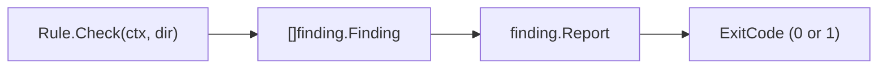
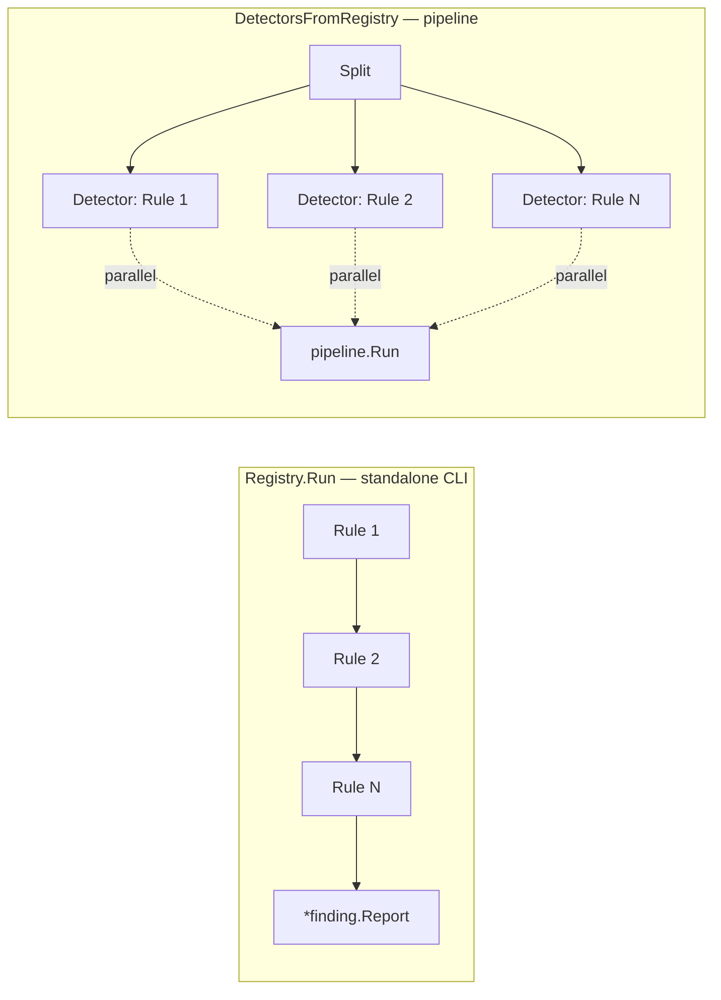

# go-linter-sdk

**A small Go library for building linters that plug into a [`finding`](https://github.com/larsartmann/go-finding)-based ecosystem.**

Every Go linter reinvents the same scaffolding — a rule interface, a registry, and a converter that bridges the linter's own issue type to the ecosystem's finding type. `go-linter-sdk` standardizes the first two and **eliminates the third**: rules emit `finding.Finding` directly, so there is no converter layer to maintain. A linter that adopts it ships a `rules.go` and a `main.go` one-liner; the registry, detector adapters, error attribution, and exit codes are shared.

[](https://pkg.go.dev/github.com/larsartmann/go-linter-sdk)
[](https://github.com/larsartmann/go-linter-sdk/actions/workflows/ci.yml)
[](LICENSE)

**[pkg.go.dev](https://pkg.go.dev/github.com/larsartmann/go-linter-sdk)**

> **Status: Early.** The `Rule`/`Registry`/`Detector` core is stable and tested (98.2% coverage, race-clean). The value proposition — eliminating converter code — is proven by `examples/no-go-mod` but **no production linter has fully migrated yet.**

---

## Why?

Every Go linter built on a shared findings format reinvents the same three layers:

| Layer                                   | What it does                                               |
| --------------------------------------- | ---------------------------------------------------------- |
| Rule interface                          | Declares a check's identity + `Check` function             |
| Registry                                | Holds rules, drives execution                              |
| **Issue → `finding.Finding` converter** | **Bridges the linter's native type to the ecosystem type** |

The third row is the killer. When a linter's own issue type predates the ecosystem's `finding.Finding`, every new finding field means touching the converter. Every refactor cascades. In the LarsArtmann ecosystem this duplication is concrete:

|                                             | branching-flow | erraudit      | go-structure-linter                    |
| ------------------------------------------- | -------------- | ------------- | -------------------------------------- |
| Rule interface                              | custom         | custom        | custom                                 |
| Registry                                    | custom         | custom        | custom                                 |
| **Violation → `finding.Finding` converter** | **1,871 LOC**  | **1,214 LOC** | **0** (`type Issue = finding.Finding`) |

`go-structure-linter` got it rightest by aliasing `Issue = finding.Finding` — no converter at all. **`go-linter-sdk` codifies that pattern.** A rule emits `finding.Finding` directly via `finding.NewBuilder(...)`, so there is no intermediate type to convert.

> The three linters in the table above are LarsArtmann-internal repositories; they are cited as evidence, not as installable consumers.

---

## Installation

```bash
go get github.com/larsartmann/go-linter-sdk
```

Requires Go 1.26+ and [`go-finding`](https://github.com/larsartmann/go-finding) (see `go.mod` for the pinned version).

---

## Quick Start

Three steps from zero to a running linter:

1. **Install** — `go get github.com/larsartmann/go-linter-sdk` (requires Go 1.26+ and a recent `go-finding`; see `go.mod`)
2. **Define rules** — write `linter.RuleFunc{Meta: ..., Run: ...}` that emits `finding.Finding` directly
3. **Run** — `registry.Run(ctx, dir)` + `linter.ExitCodeFromReport(report)`

A complete runnable example is at [`examples/minimal-linter`](examples/minimal-linter). See [Usage](#usage) below for the full walkthrough.

---

## Usage

### A minimal linter

```go
package main

import (
    "context"
    "os"

    "github.com/larsartmann/go-finding"
    "github.com/larsartmann/go-linter-sdk"
)

var registry = linter.NewRegistry()

func init() {
    registry.Register(linter.RuleFunc{
        Meta: linter.RuleMeta{
            ID:          "no-fmt-println",
            Name:        "no fmt.Println in libraries",
            Description: "fmt.Println is banned in libraries; use a logger",
            Cat:         linter.CategoryStyle,
            Sev:         finding.SeverityWarning,
        },
        Run: func(ctx context.Context, dir string) ([]finding.Finding, error) {
            // ... scan dir for fmt.Println; emit findings directly ...
            return []finding.Finding{
                finding.NewBuilder("no-fmt-println", "my-linter",
                    "fmt.Println is banned in libraries; use a logger",
                    finding.SeverityWarning,
                    finding.Pos(finding.FilePath("example.go"), 1, 1)).
                    MustBuild(),
            }, nil
        },
    })
}

func main() {
    report, _ := registry.Run(context.Background(), ".")
    os.Exit(linter.ExitCodeFromReport(report))
}
```

> A complete, runnable version lives at [`examples/minimal-linter`](examples/minimal-linter) — run it with `GOEXPERIMENT=jsonv2 go run ./examples/minimal-linter [dir]`.

### Plug into BuildFlow's DAG

```go
detector := linter.DetectorFromRegistry(registry, "my-linter")
// Pass `detector` to toolsdk.Spec{ Detect: detector, ... } or directly to
// BuildFlow's domain.DetectorFromFinding(detector, toolName).
```

The working directory is read via `finding.WorkingDirFromContext(ctx)`, so module fan-out and per-directory runs work transparently.

### Plug into go-finding/pipeline (per-rule parallelism)

```go
detectors := linter.DetectorsFromRegistry(registry)
// Pass `detectors` to pipeline.New(config, rootDir, detectors...) for
// per-detector parallelism, timeouts, error isolation, and metrics.
//
// Unlike DetectorFromRegistry (which collapses all rules into one opaque
// detector), each detector is named after the rule's ID — the pipeline
// attributes timing and errors to individual rules.
```

### Building findings with Confidence and FixStrategy

Each finding carries its own `Confidence` and `FixStrategy`, set via
`finding.NewBuilder(...)`. This is strictly more expressive than rule-level
defaults: a single rule can emit findings with different confidence levels and
fix strategies depending on the matched pattern.

```go
return []finding.Finding{
    finding.NewBuilder(ruleID, toolName, "unused variable", severity, pos).
        WithConfidence(finding.ConfidenceHigh).
        WithFixStrategy(finding.FixStrategyDirect).
        MustBuild(),
}, nil
```

| `Confidence`       | When to use                            |
| ------------------ | -------------------------------------- |
| `ConfidenceLow`    | Heuristic match; may be false positive |
| `ConfidenceMedium` | Likely a real issue                    |
| `ConfidenceHigh`   | Definitely a real issue                |

| `FixStrategy`        | Meaning                       |
| -------------------- | ----------------------------- |
| `FixStrategyNone`    | No fix available              |
| `FixStrategySuggest` | Suggest a fix in output       |
| `FixStrategyDirect`  | Can auto-fix programmatically |
| `FixStrategyAI`      | Requires AI to generate a fix |

### Data flow

Rules emit `finding.Finding` directly — no intermediate type. The SDK aggregates, reports, and maps to exit codes:



```
Rule.Check(ctx, dir) → []finding.Finding → Report → ExitCode (0 clean / 1 findings)
```

### Two execution paths

The SDK offers two ways to run rules. Pick based on your integration target:



<details>
<summary>ASCII fallback (for pkg.go.dev)</summary>

```
Registry.Run (standalone CLI):     Rule 1 → Rule 2 → Rule N → *finding.Report
DetectorsFromRegistry (pipeline): Split → [Detector: Rule 1 | Rule 2 | Rule N] → pipeline.Run
```

</details>

|                    | `Registry.Run`                             | `DetectorsFromRegistry`                   |
| ------------------ | ------------------------------------------ | ----------------------------------------- |
| **Execution**      | Sequential                                 | Parallel (one goroutine per rule)         |
| **Failure policy** | Fail-fast (default) or `ContinueOnError()` | Per-detector isolation (pipeline handles) |
| **Granularity**    | Single opaque run                          | Per-rule detectors with named metrics     |
| **Best for**       | Simple CLI linters                         | go-finding/pipeline, BuildFlow DAG        |

---

## API

### Types

| Type              | Purpose                                                                                                                           |
| ----------------- | --------------------------------------------------------------------------------------------------------------------------------- |
| `Rule` interface  | `ID()` / `Name()` / `Description()` / `Category()` / `Severity()` / `IsEnabledByDefault()` / `Check(ctx, dir) ([]Finding, error)` |
| `RuleFunc` struct | Adapter: combines a `RuleMeta` header with a `Run` closure to satisfy `Rule`. Enabled by default.                                 |
| `RuleMeta` struct | Declarative identity: `ID` (required, stable), `Name`, `Description`, `Cat`, `Sev`                                                |
| `Category`        | Open `string` type. 8 recommended values (`CategoryDesign`, ...); define your own for domain-specific taxonomies                  |
| `Registry`        | Holds rules; thread-safe with `sync.RWMutex`                                                                                      |

### Functions

| Function                            | Returns                  | Purpose                                                                                               |
| ----------------------------------- | ------------------------ | ----------------------------------------------------------------------------------------------------- |
| `NewRegistry(opts…)`                | `*Registry`              | Empty registry; pass `WithToolName(...)` to stamp tool name onto findings                             |
| `WithToolName(name)`                | `RegistryOption`         | Stamp the tool name onto all findings and the report                                                  |
| `(*Registry).Register(rule)`        | —                        | Add a rule (panics on duplicate ID or empty identity fields)                                          |
| `(*Registry).All()`                 | `[]Rule`                 | Snapshot of registered rules                                                                          |
| `(*Registry).Get(id)`               | `Rule, bool`             | Lookup by stable ID                                                                                   |
| `(*Registry).Has(id)`               | `bool`                   | Check if a rule ID is registered                                                                      |
| `(*Registry).Deregister(id)`        | `bool`                   | Remove a rule by ID (returns true if found)                                                           |
| `(*Registry).Run(ctx, dir, opts…)`  | `*finding.Report, error` | Run all rules; aggregate findings. Fail-fast by default; pass `ContinueOnError()` for partial results |
| `ContinueOnError()`                 | `RunOption`              | Run option: continue past rule failures, collect partial findings, join errors                        |
| `DetectorFromRegistry(r, toolName)` | `finding.Detector`       | Adapt registry to a single Detector (BuildFlow DAG)                                                   |
| `DetectorsFromRegistry(r)`          | `[]finding.Detector`     | One Detector per rule (go-finding/pipeline: per-rule parallelism, timeouts, error isolation)          |
| `ExitCodeFromReport(report)`        | `int`                    | 0 if clean, 1 if findings — the ecosystem exit-code convention                                        |
| `ExitCodeByConfidence(report, thr)` | `int`                    | 0 clean / 1 at-or-above threshold / 2 below threshold (triage mode)                                   |
| `FilterRules(all, enable, disable)` | `[]RuleFunc`             | Standard --enable/--disable filtering for CLI and plugin entry points                                 |
| `OptIn(rf)`                         | `Rule`                   | Wrap a `RuleFunc` as disabled-by-default (opt-in rule; runs only with explicit `--enable <id>`)       |
| `RuleFunc.NewFinding(msg, pos)`     | `*finding.Builder`       | Pre-stamped builder from rule metadata (rule ID, tool name, severity, category)                       |
| `RuleMeta.Validate()`               | `error`                  | Check required fields (ID, Name, Description, Cat) before construction                                |

---

## Design notes

- **Depends only on `go-finding`** (the ecosystem hub) so any consumer — CLI, library, LSP server, golangci-lint plugin — can adopt it without coupling.
- **Rules emit `finding.Finding` directly.** No intermediate Violation/Issue type. No converter layer. This is the core design decision.
- **Dual identity: `ID()` + `Name()`.** `ID()` is the stable identifier (never changes, used for dedup/suppression/filtering); `Name()` is the display name (mutable). Every rule must declare an explicit ID.
- **`Category` is an open type.** The 8 built-in constants are recommendations. Define your own for domain-specific taxonomies: `linter.Category("api")`.
- **`Registry.Register` panics on duplicate IDs or empty identity fields** — duplicate or missing rule IDs/Names/Descriptions/Categories are programming errors that should surface at startup.
- **Two execution paths.** `Registry.Run` for standalone CLI (sequential, fail-fast or `ContinueOnError`); `DetectorsFromRegistry` for go-finding/pipeline (parallel, per-rule isolation).
- **Per-finding Confidence and FixStrategy.** Use `finding.NewBuilder(...).WithConfidence(...).WithFixStrategy(...)` to set these per finding — more expressive than rule-level defaults.
- **`ExitCodeFromReport` is binary** (0 clean / 1 any findings). The ecosystem convention; tools that want severity-tiered exit codes do their own mapping.

---

## Migration path

Existing linters migrate **incrementally** — one rule at a time:

1. Add `go-linter-sdk` as a dependency
2. Pick one rule; convert its native type to emit `finding.Finding` via `finding.NewBuilder(...)`
3. Wrap it in `linter.RuleFunc{Meta: ..., Run: ...}` and `Register` it
4. Repeat for each rule
5. Once all rules are migrated, delete the converter package (`pkg/finding/` in branching-flow / erraudit)

Each step compiles and runs independently. No big-bang migration.

---

## Consumers

Example consumers in this repo:

- `examples/minimal-linter` — minimal linter proving the Rule → `finding.Finding` path
- `examples/no-go-mod` — pilot port of `go-structure-linter`'s `NoGoModRule`

Planned adoption targets:

- `go-structure-linter` — cleanest existing pattern; pilot target
- `branching-flow` (1,871 LOC of converters to delete)
- `erraudit` (1,214 LOC of converters to delete)
- Future linters

No external consumers yet.

## Status

Early. The `Rule`/`Registry`/`Detector` core is stable. The migration story is proven by `examples/no-go-mod` (a pilot port of `go-structure-linter`'s `NoGoModRule`) but no production linter has fully migrated yet.

## Support & security

Open repository: issues and PRs from anyone are welcome, maintained
best-effort with no SLAs — see [SUPPORT.md](SUPPORT.md). Vulnerabilities go
through private advisories, never public issues — see [SECURITY.md](SECURITY.md).

## License

MIT — see [LICENSE](LICENSE).
